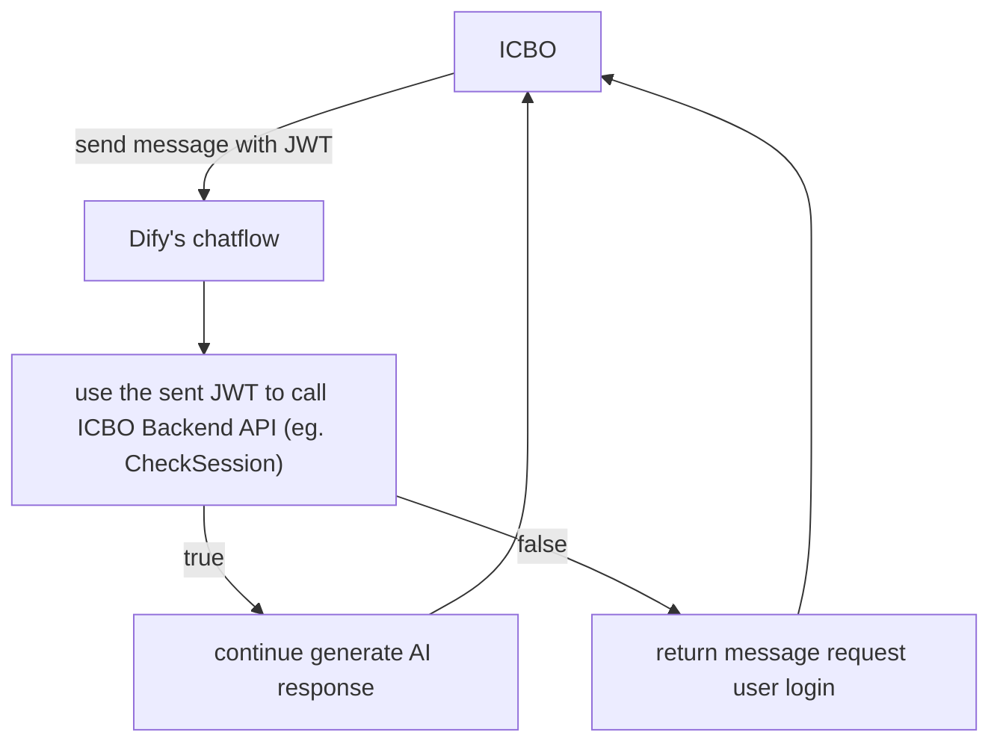

## ICBO chatbot validation

```mermaid
flowchart TD
A[ICBO] -->|send message with JWT| B[Dify's chatflow] --> C["use the sent JWT to call ICBO Backend API (eg. CheckSession)"]
C --> |true| D[continue generate AI response]
C --> |false| E[return message request user login]
D --> A
E --> A

```